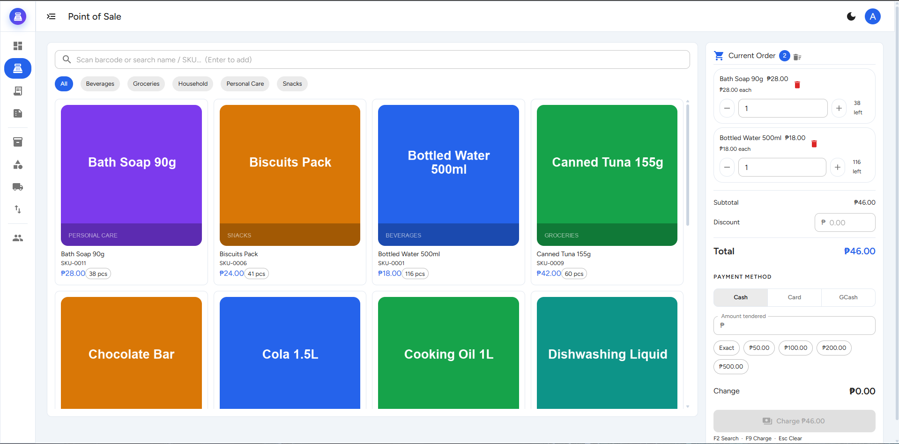
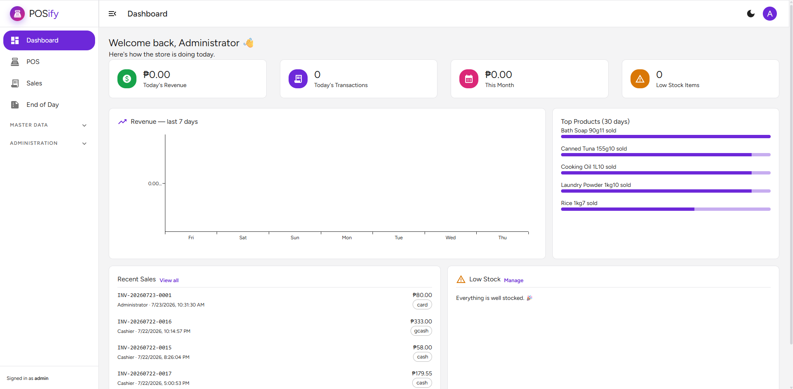
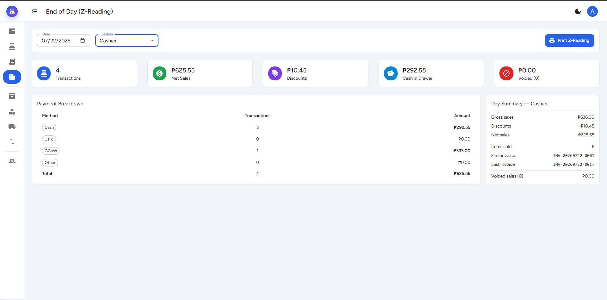
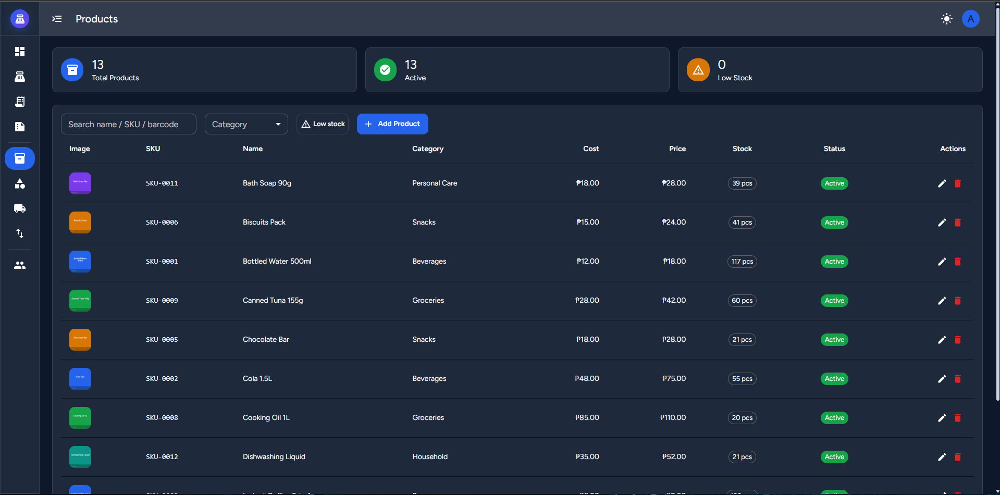

# 🛒 POSify — POS + Inventory System

[](https://github.com/Ellijah-Diaz/pos-inventory-system/actions/workflows/tests.yml)


A full-featured **Point of Sale + Inventory Management system** for small retail —
built as a single-folder monolith with **Laravel 12 + Inertia.js + React 18 + Material UI**.
Covers the complete retail loop: products in → sales out → stock reconciled → day closed.

> **65 automated tests · 201 assertions** — checkout, stock, voids, reports, validation, and role access are all covered.

---

## ✨ Features

### 🧾 Point of Sale
- Barcode / SKU / name search with **Enter-to-add** scanning flow
- Product grid with images, live **cart-aware stock counters**, category filters
- Cart with quantity steppers, discounts, quick-cash chips, change calculation
- Cash / Card / GCash payments — cash must cover the total, guarded server-side
- **80mm thermal receipt** printing
- Keyboard shortcuts: `F2` search · `F9` charge · `Esc` clear

### 📦 Inventory
- Products (single image, cost/selling price, reorder levels), Categories, Suppliers
- **Stock movements audit trail** — every in/out/adjustment logs before → after, who, and why
- Low-stock alerts with one-click restock
- Guards: stock can never go negative; all updates run in locked DB transactions

### 💰 Sales Management
- Sales history with invoice search, date-range and **status filters**
- **Void/refund flow** (admin-only): requires a reason, restores stock, logs the reversal,
  keeps a full audit trail (who/when/why) — voided sales are excluded from revenue
- Per-invoice detail modal with line-item breakdown

### 📊 Reporting
- Dashboard: today/month revenue, 7-day chart, top products, low-stock widget
- **End-of-Day (Z-Reading)**: net sales, payment-method breakdown,
  **expected cash in drawer**, voided totals, first/last invoice — printable in thermal format
- Cashiers see their own shift; admins can review any day / any cashier

### 🔐 Users & Access
- Two roles: **Admin** (everything) and **Cashier** (POS + sales + own Z-reading)
- Admin-managed accounts (no public registration), activation toggle,
  self-lockout protection (can't demote/deactivate/delete yourself)
- Deactivated users are blocked at login

### 🎨 UX
- **Light/dark mode** (persisted, OS-aware) across every page including auth
- Collapsible mini sidebar with accordion groups
- Contextual empty states, dialog ✕ buttons, theme-aware toasts and scrollbars
- Branded auth pages with password visibility toggle

---

## 📸 Screenshots

| POS | Dashboard |
|---|---|
|  |  |

| End of Day (Z-Reading) | Dark mode |
|---|---|
|  |  |

---

## 🛠 Tech Stack

| Layer | Technology |
|---|---|
| Backend | Laravel 12 (PHP 8.2), Breeze (session auth) |
| Bridge | Inertia.js v2 — no separate API, controllers render React pages directly |
| Frontend | React 18 (JSX), Material UI v9, Tailwind CSS 3 |
| Database | MySQL 8 |
| Build | Vite 7 |
| Testing | Pest (feature-tested against a real MySQL test DB) |
| CI | GitHub Actions — full suite on every push |

---

## 🏗 Engineering Highlights

- **Money paths are transactional** — checkout and voids run inside DB transactions with
  `lockForUpdate`; prices are always read from the database, never trusted from the client
- **Immutable sales history** — line items snapshot the product name/price, so editing or
  deleting a product never corrupts past invoices
- **Deletion-safe schema** — foreign keys use `nullOnDelete` / `cascadeOnDelete` deliberately
  per relationship; deleting a category, supplier, product, or user never orphans data
- **Everything is audited** — stock changes, voids, and sales all record who did what and when

---

## 🚀 Getting Started

```bash
git clone https://github.com/Ellijah-Diaz/pos-inventory-system.git
cd pos-inventory-system

composer install
npm install

cp .env.example .env          # set DB_DATABASE=pos_inventory etc.
php artisan key:generate

mysql -u root -e "CREATE DATABASE pos_inventory"
php artisan migrate:fresh --seed              # schema + demo accounts + products
php artisan storage:link                      # serve product images
php artisan db:seed --class=ProductImageSeeder  # generated product images
php artisan db:seed --class=SalesDemoSeeder     # sample sales for the dashboard

npm run build
php artisan serve             # + npm run dev for hot reload
```

**Demo accounts** (after seeding):

| Role | Email | Password | Sees |
|---|---|---|---|
| Admin | `admin@gmail.com` | `1234567890` | Everything — master data, users, any cashier's Z-reading |
| Cashier | `cashier@gmail.com` | `password` | POS, sales, and their own shift only |

Sign in as both — the difference between them is the point of the access model.

Full build notes and command history: [SETUP.md](SETUP.md)

---

## ✅ Tests

```bash
mysql -u root -e "CREATE DATABASE pos_inventory_test"   # once
php artisan test
```

The suite covers POS checkout (stock deduction, oversell/underpay rejection), void safety
(double-void locking, stock restoration), Z-reading accuracy, a validation audit of every
endpoint, image uploads, user management guards, and role-based access control.

---

## 🗺 Roadmap

- [ ] Shift sessions (X-reading, cash count with over/short recording)
- [ ] Server-side product pagination on the POS grid
- [ ] CSV/PDF exports (sales, inventory, profit reports)
- [ ] Activity log viewer (product edits, price changes)
- [ ] Barcode label printing
- [ ] Granular permissions (manager role)

---

*Built by [Ellijah Diaz](https://github.com/Ellijah-Diaz) — system #1 of a portfolio series.*
